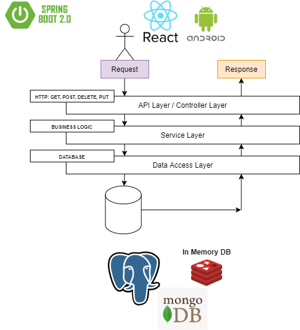

Following a Spring Boot Tutorial (https://youtu.be/vtPkZShrvXQ) based on Spring Initializer (https://start.spring.io/)
* UUID Generator (https://www.uuidgenerator.net/)



# Connectivity with PostgreSQL

```
$ docker run --name postgres-spring -e POSTGRES_PASSWORD=password -e POSTGRES_PASSWORD=password -d -p 5432:5432 postgres:alpine
$ docker ps
$ docker port postgres-spring

```
